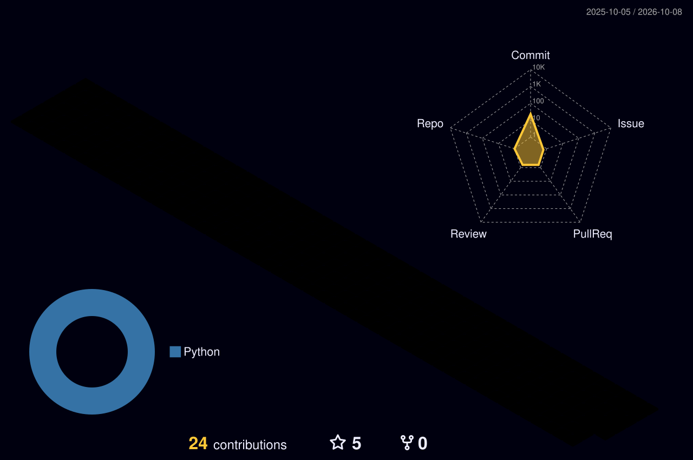

<!-- Hero banner -->

  

  

  
  
  

---

### 👨‍💻 About me

I'm a **Backend Engineer** at **CoinQuant (Abu Dhabi)**, where I started as a full stack developer and now work as an algorithmic trader building the systems behind our backtesting platform.

- ⚡ Built an **event-driven backtesting platform on AWS Lambda + SQS** running **800+ concurrent Python jobs** with zero production failures
- 🛡️ Designed for failure: dead-letter queues with redrive, idempotent PostgreSQL writes with retry/backoff, and idempotent credit refunds
- 📈 Built a **slippage model** for more realistic backtests and led a **multi-position scaling** feature for advanced position sizing
- 🧪 Champion of a full **testing pyramid** — unit, integration and quality gates that keep the codebase healthy
- 📦 Led the microservices packaging migration from **Bazel to Poetry**
- 🎓 Software Engineering Factory bootcamp (**Star Developer**) · Psychology @ American University of Beirut

### 🛠️ Tech stack

   
  

  
  
  
  
  
  

### 📊 GitHub activity

  

  

  

